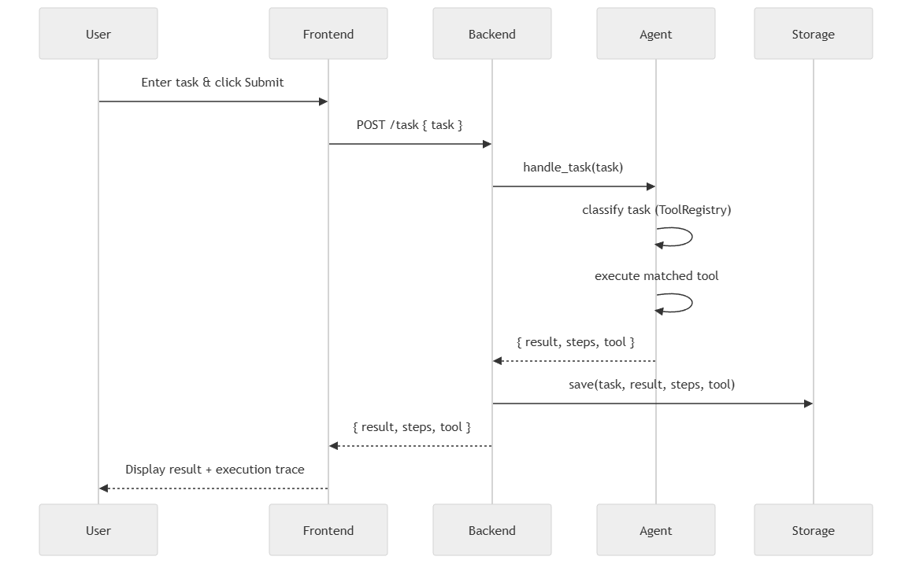
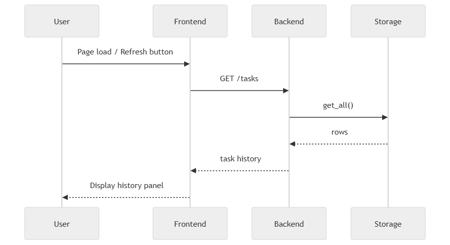
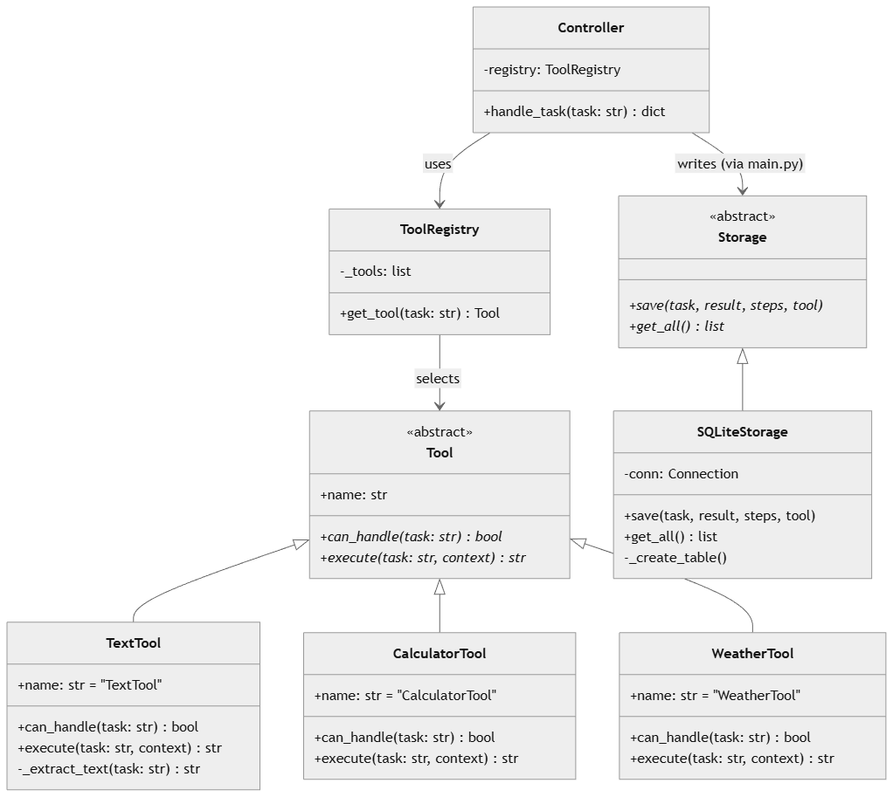

# Task Agent Orchestrator

## Overview

This project implements a lightweight agent-based system that processes user tasks, selects appropriate tools, and executes them while providing a transparent execution trace.

The system demonstrates core agentic patterns including:

- Tool selection
- Execution tracing
- Modular architecture

---

## Features

- Task submission via UI
- Agent-based decision making
- Multiple tools (text, calculator, weather mock)
- Execution trace visualization
- Task history persistence

---

## Tech Stack

- Backend: Python (FastAPI)
- Frontend: React
- Storage: SQLite

---

## Project Structure and Architecture

### HLD

The system follows a layered architecture:


### Sequence Diagram

#### Task Submission Flow



#### History Load Flow



### Class Diagram



---

## Repository Structure

```bash
agent-task-system/
│
├── backend/
│   ├── app/
│   │   ├── main.py                    # API entry point
│   │   │
│   │   ├── agent/
│   │   │   ├── controller.py          # orchestrator
│   │   │
│   │   │
│   │   ├── tools/
│   │   │   ├── base_tool.py           # interface
│   │   │   ├── text_tool.py
│   │   │   ├── calculator_tool.py
│   │   │   ├── weather_tool.py
│   │   │   └── tool_registry.py
│   │   │
│   │   └── storage/
│   │       ├── storage.py             # interface
│   │       ├── sqlite_storage.py
│   │
│   ├── test
│   │   ├── test_backend_unit.py
│   │   └── unit_test_results.txt
│   ├── Dockerfile
│   └── requirements.txt
│
├── frontend/
│   ├── src/
│   │   ├── App.jsx
│   │   ├── api.js
│   │   ├── components/
│   │   │   ├── TaskForm.jsx
│   │   │   ├── ResultPanel.jsx
│   │   │   ├── TracePanel.jsx
│   │   │   └── HistoryPanel.jsx
│   │   └── App.css
│   │
│   ├── test/
│   │    ├── TaskForm.test.jsx
│   │    ├── ResultPanel.test.jsx
│   │    ├── TracePanel.test.jsx
│   │    ├── HistoryPanel.test.jsx
│   │    └── unit_test_results.txt
│   ├── setupTests.js
│   ├── index.html
│   ├── vite.config.js
│   └── package.json
│
├── docs/
│   ├── HLD.drawio.png
│   ├── sequence_task_submission.png
│   ├── sequence_history.png
│   └── class_diagram.png
│
├── .gitignore
└── README.md

```

---

## Prerequisites

- Python 3.11+
- Node 18+

## How to Run

### Backend

```bash
cd backend

# Virtual environment creation
# Windows users
python -m venv .venv
.venv\Scripts\Activate

# Mac users
python3 -m venv .venv
source .venv/bin/activate

# Install dependencies
pip install -r requirements.txt

# Start the server
# Windows
$env:PYTHONPATH = "app" ; .venv\Scripts\python.exe -m uvicorn app.main:app --reload

# Mac / Linux
PYTHONPATH=app .venv/bin/uvicorn app.main:app --reload

```

- Server runs at: http://localhost:8000
- Interactive API docs or Swagger: http://localhost:8000/docs

```json
// Post /task
// In Swagger, click "Try it out" then replace the body with one of these and click "Execute"

{ "task": "uppercase: hello world" }
{ "task": "3 + 5" }
{ "task": "weather in Paris" }
{ "task": "count: one two three four" }

// GET /tasks
// In Swagger, click "Try it out" then click "Execute"
// This will return the full history of all tasks saved to the DB

```

### Backend (Docker)

The backend can be run as a Docker container using the provided Dockerfile.

```bash
# Build the image
docker build -t task-agent-backend ./backend

# Run the container
docker run -p 8000:8000 task-agent-backend

```

- Server runs at: http://localhost:8000
- SQLite database is stored inside the container (resets on restarting the container) or volume mounting is needed for data persistence

### Backend Test

```bash
cd backend

# Run unit tests
.venv\Scripts\python.exe -m pytest test/test_backend_unit.py -v

# Save results to a text file
.venv\Scripts\python.exe -m pytest test/test_backend_unit.py -v > test/unit_test_results.txt 2>&1
```

### Frontend

```bash
cd frontend

# Install dependencies
npm install

# Start the dev server
npm start
```

- App runs at: http://localhost:5173
- Requires the backend to be running at http://localhost:8000

### Frontend Test

Frontend tests use Vitest and React Testing Library — no browser required.

```bash
cd frontend

# Run tests in terminal
npm test -- --run

# Run tests and open interactive browser UI
npm test -- --ui
```

The `--ui` mode opens a live dashboard at `http://localhost:51204/__vitest__/` and re-runs tests on file changes.
The HTML report is saved to `frontend/test-report/index.html` (excluded from git).

**Note:** Test results are added in a text file named `unit_test_results.txt` in the folder named `test` for both backend and frontend

---

## Design Decisions

### Assumptions

- Input is plain English or simple arithmetic expressions
- Tasks are single-step: one input maps to one tool and one result
- Weather data does not need to be real; a mock response is sufficient for this demo
- No integration with external model providers (OpenAI, Azure, AWS) is required
- Single user — no authentication or authorisation is required

### Overall

- Rule-based task classification for simplicity and determinism
- Tool abstraction for extensibility
- Separation of concerns across layers
- SOLID principle compliance throughout

### Frontend

- Gradual component development: TaskForm and ResultPanel first, TracePanel and HistoryPanel added incrementally
- Each component is a pure presentational component receiving props from App.jsx, keeping state management centralised
- Vite proxy forwards API calls to the backend, avoiding CORS issues in development
- Vitest with React Testing Library for component tests — no browser or running server needed
- Components: `TaskForm` (input + submission), `ResultPanel` (tool badge + result), `TracePanel` (execution steps), `HistoryPanel` (past tasks)

### Backend

- Reactive/reflexive agent: perceive input → match against rules → execute action
- Rules are defined as separate tools (`TextTool`, `CalculatorTool`, `WeatherTool`), making the design extensible for future improvements
- Agent, Storage, and Tools are isolated packages to enforce separation of concerns and mirror LLM-based agentic system structure
- Storage package has an abstract base class (`Storage`) enabling alternative database backends; currently implements SQLite to store task output, metadata, and execution steps
- Agent controller acts as task orchestrator: receives input, selects a tool via `ToolRegistry`, executes it, builds a 4-step execution trace, and returns the result
- `ToolRegistry` iterates registered tools in priority order and returns the first match via `can_handle()` — no separate classifier needed
- `main.py` is the API entry point, exposing `POST /task` (process and persist) and `GET /tasks` (retrieve history) with Pydantic request validation
- Added Dockerfile if containerization is needed

---

## Time Spent

- Architecture and design: 5-6 hrs
- Frontend dev: 7-8 hrs
- Backend dev: 5-6 hrs

---

## Future Improvements

- **Add multi-step planning and tool chaining**  
  Extend the controller with a lightweight `Planner` that decomposes compound requests into ordered steps, executes multiple tools in sequence, passes intermediate outputs between them, and combines results (e.g. `"count words in 'hello world' and multiply by 5"` → `WordCount` → `Calculator`). A simple detection approach can be: split on `"and"` / `"then"`.This would move the system from single-tool execution toward a small plan-and-execute workflow.

- **Introduce utility-based tool selection**  
  When multiple tools are eligible, the current registry could be extended with scoring logic based on confidence, latency, etc. This would make tool selection more robust and move the system closer to a **utility-based agent** model, where the best action is selected from several valid options rather than simply choosing the first match.

- **Evolve the agent beyond a simple reflex pattern**  
  The current implementation behaves like a lightweight reflex agent: it inspects the input, applies deterministic rules, and utilizes a matching tool. In the next step, we could introduce a **model-based or goal-based agent** that maintains task context, tracks states, and chooses actions based on an explicit objective rather than a predefined rule match.

- **Improve observability with structured logging and metrics**  
  Add structured application logs for task receipt, classification, tool selection, tool execution, persistence success/failure, and API responses,in order to make debugging easier and improve transparency during DEV and PROD stages.

- **Add guardrails and safer execution paths**  
  Introduce input validation and execution guardrails before tool invocation for rejecting unsupported calculator expressions, sanitizing malformed inputs, and returning fallback responses when no tool matches. For future LLM integration, this layer could be extended with prompt-injection defenses, output validation, and policy-based restrictions on which tools are allowed to run.

- **Strengthen persistence and data modeling**  
  SQLite is a good lightweight choice for the challenge, but the storage abstraction could later support PostgreSQL or another database backend without changing the agent or API layers, as well as including richer task metadata and indexed history queries.

- **Improve frontend usability and trace inspection**  
  The frontend could be enhanced with better task history filtering, expandable trace rows, loading and error states, and improve color contrast, ideally by creating a Figma design in advance.

- **Support streaming execution updates**  
  Instead of returning execution steps only at the end of a request, the backend could stream trace events incrementally so the frontend displays the agent’s progress in real time to make the app feel more interactive.

- **Enable agent learnings**  
  In a later version, tool-selection outcomes could be recorded and user feedback to evaluate whether routing decisions were correct. This could gradually support a lightweight **learning agent** pattern using historical examples and evaluation signals rather than relying only on predefined rules.
