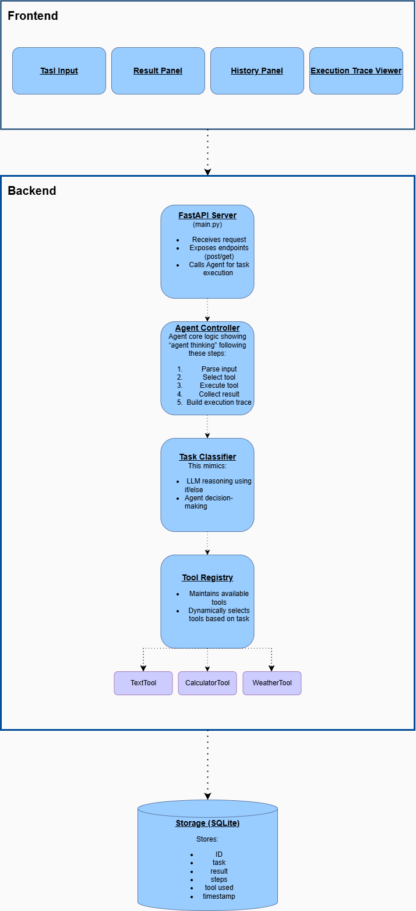

# Task Agent Orchestrator

## Overview

This project implements a lightweight agent-based system that processes user tasks, selects appropriate tools, and executes them while providing a transparent execution trace.

The system demonstrates core agentic patterns including:

- Tool selection
- Execution tracing
- Modular architecture

---

## Features

- Task submission via UI
- Agent-based decision making
- Multiple tools (text, calculator, weather mock)
- Execution trace visualization
- Task history persistence

---

## Tech Stack

- Backend: Python (FastAPI)
- Frontend: React
- Storage: SQLite

---

## Project Structure and Architecture

### HLD

The system follows a layered architecture:


### Sequence Diagram

---

## Repository Structure

```bash
agent-task-system/
│
├── backend/
│   ├── app/
│   │   ├── main.py                    # API entry point
│   │   │
│   │   ├── agent/
│   │   │   ├── controller.py          # orchestrator
│   │   │
│   │   │
│   │   ├── tools/
│   │   │   ├── base_tool.py           # interface
│   │   │   ├── text_tool.py
│   │   │   ├── calculator_tool.py
│   │   │   ├── weather_tool.py
│   │   │   └── tool_registry.py
│   │   │
│   │   └── storage/
│   │       ├── storage.py             # interface
│   │       ├── sqlite_storage.py
│   │
│   ├── test/
│   │
│   └── requirements.txt
│
├── frontend/
│   ├── src/
│   │   ├── App.jsx
│   │   ├── api.js
│   │   ├── components/
│   │   │   ├── TaskForm.jsx
│   │   │   ├── ResultPanel.jsx
│   │   │   ├── TracePanel.jsx
│   │   │   └── HistoryPanel.jsx
│   │   └── App.css
│   │
│   ├── test/
│   │    ├── TaskForm.test.jsx
│   │    ├── ResultPanel.test.jsx
│   │    ├── TracePanel.test.jsx
│   │    └── HistoryPanel.test.jsx
│   ├── setupTests.js
│   ├── index.html
│   ├── vite.config.js
│   └── package.json
│
├── docs/
│   ├──HLD.png
│   ├── sequence_diagram.png
│   └── class_diagram.png
│
├── .gitignore
└── README.md

```

---

## Prerequisites

- Python 3.11+
- Node 18+

## How to Run

### Backend

```bash
cd backend

# Virtual environment creation
# Windows users
python -m venv .venv
.venv\Scripts\Activate

# Mac users
python3 -m venv .venv
source .venv/bin/activate

# Install dependencies
pip install -r requirements.txt

# Start the server
# Windows
$env:PYTHONPATH = "app" ; .venv\Scripts\python.exe -m uvicorn app.main:app --reload

# Mac / Linux
PYTHONPATH=app .venv/bin/uvicorn app.main:app --reload

```

- Server runs at: http://localhost:8000
- Interactive API docs or Swagger: http://localhost:8000/docs

```json
// Post /task
// In Swagger, click "Try it out" then replace the body with one of these and click "Execute"

{ "task": "uppercase: hello world" }
{ "task": "3 + 5" }
{ "task": "weather in Paris" }
{ "task": "count: one two three four" }

// GET /tasks
// In Swagger, click "Try it out" then click "Execute"
// This will return the full history of all tasks saved to the DB

```

### Backend Test

```bash
cd backend

# Run unit tests
.venv\Scripts\python.exe -m pytest test/test_backend_unit.py -v

# Save results to a log file
.venv\Scripts\python.exe -m pytest test/test_backend_unit.py -v > test/unit_test_results.log 2>&1
```

### Frontend

```bash
cd frontend

# Install dependencies
npm install

# Start the dev server
npm start
```

- App runs at: http://localhost:5173
- Requires the backend to be running at http://localhost:8000

### Frontend Test

Frontend tests use Vitest and React Testing Library — no browser required.

```bash
cd frontend

# Run tests in terminal
npm test -- --run

# Run tests and open interactive browser UI
npm test -- --ui
```

The `--ui` mode opens a live dashboard at `http://localhost:51204/__vitest__/` and re-runs tests on file changes.
The HTML report is saved to `frontend/test-report/index.html` (excluded from git).

---

## Design Decisions

### Assumptions

- Input is plain English or simple arithmetic expressions
- Tasks are single-step: one input maps to one tool and one result
- Weather data does not need to be real; a mock response is sufficient for this demo
- No integration with external model providers (OpenAI, Azure, AWS) is required
- Single user — no authentication or authorisation is required

### Overall

- Rule-based task classification for simplicity and determinism
- Tool abstraction for extensibility
- Separation of concerns across layers
- SOLID principle compliance throughout

### Frontend

- Gradual component development: TaskForm and ResultPanel first, TracePanel and HistoryPanel added incrementally
- Each component is a pure presentational component receiving props from App.jsx, keeping state management centralised
- Vite proxy forwards API calls to the backend, avoiding CORS issues in development
- Vitest with React Testing Library for component tests — no browser or running server needed
- Components: `TaskForm` (input + submission), `ResultPanel` (tool badge + result), `TracePanel` (execution steps), `HistoryPanel` (past tasks — in progress)

### Backend

- Reactive/reflexive agent: perceive input → match against rules → execute action
- Rules are defined as separate tools (`TextTool`, `CalculatorTool`, `WeatherTool`), making the design extensible for future improvements
- Agent, Storage, and Tools are isolated packages to enforce separation of concerns and mirror LLM-based agentic system structure
- Storage package has an abstract base class (`Storage`) enabling alternative database backends; currently implements SQLite to store task output, metadata, and execution steps
- Agent controller acts as task orchestrator: receives input, selects a tool via `ToolRegistry`, executes it, builds a 4-step execution trace, and returns the result
- `ToolRegistry` iterates registered tools in priority order and returns the first match via `can_handle()` — no separate classifier needed
- `main.py` is the API entry point, exposing `POST /task` (process and persist) and `GET /tasks` (retrieve history) with Pydantic request validation

---

## Time Spent

- Architecture and design:
- Frontend dev:
- Backend dev:

---

## Future Improvements

- **LLM-based task understanding** — replace rule-based routing with an LLM classifier for more flexible and natural input handling
- **Multi-step task chaining** — decompose compound inputs into sequential steps, execute multiple tools, and combine results (e.g. `"count words in 'hello world' and multiply by 5"` → `WordCount` → `Calculator`); detection approach: split on `"and"` / `"then"`
- **Multi-user support** — add authentication and authorisation for concurrent users
- **Live weather data** — replace the mock with a real provider (e.g. OpenWeatherMap API)
- **Improve UI look and feel** — create a Figma design system, improve color contrast, add more functionalities, and enhance user experience
